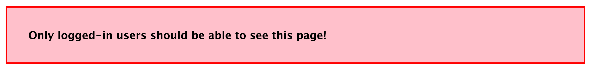
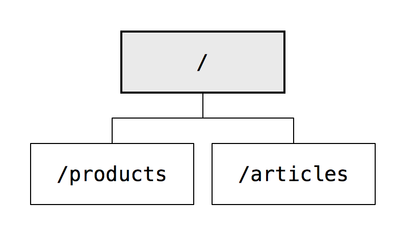

# Express Middleware Practice

## Objectives

By the end of this lesson you should be able to:

- Use application-level middleware to redirect all unauthenticated requests to all routes that appear "after" that middleware
- Use middleware sub-stacks to redirect all unauthorized requests to all routes that use that middleware
- Describe what Express middleware is and how next() works
- Draw a middleware chain when given an express app (including both application-level and route-level middleware)

Guiding questions:

- What does `next` do?
- What happens if you don't call it?
- Does order matter when adding middleware? Why or why not?
- What is the difference between a route and middleware?

## You know you are successful when...

Overall: you should never see a red error message as a visitor or a logged in user.  Your challenge is to make it so that a users can never make it to a page that has this error message:



Or this error message:


Articles and Products:

- As a logged out visitor, when you go to any Products or Articles link, you are redirected to the login page
- As a logged in user, when you go to any Products or Articles link, you see a blue success message

Users:

- As a logged out visitor, when you go to View All Users, you should be redirected to the login page
- As a logged in user, when you go to View All Users, you should see the list of users
- As a logged in user, when you go to View All Users and click on your own name, you should be able to both see your "show" page and also be able to see your "edit" page
- As a logged in user, when you go to View All Users and click on someone _else's_ name, you should be redirected to the login
- As a public visitor, when you are on the homepage, and you click on a user's profile, you should see the blue success message

Login / Logout:

- As a public visitor, when you go to the homepage and login page, you should see not be redirected anywhere

## Activities

**Draw a site map**

Using the drawing tool of your choice, create a org-chart-esque sitemap.  It should start looking something like:



When you are done, compare your sitemap to the one [here](wireframes/sitemap-complete.png).

The blue boxes indicate routes that require users to be logged in.  The red boxes indicate routes that require both that the user be logged in and _also_ that the user id in the route matches the logged in user.

**Write application-level middleware**

Protect all articles and products routes using application-level middleware in `app.js`

Use http://expressjs.com/guide/using-middleware.html#middleware.application as a guide.

**Write middleware sub-stacks**

Search http://expressjs.com/guide/using-middleware.html for examples of how to create sub-stacks.

- Protect the users index page to only allow logged-in users (middleware sub-stack in `routes/users.js`)
- Protect the users show and edit page to only allow logged-in users who match the url (middleware sub-stack in `routes/users.js`).  Use the _same_ function to do this :)

(Make sure that user profiles remain public)

Guiding questions:

- What is a middleware sub-stack?  How does it differ from other middleware?
- What's the difference between middleware added to a `router` instance, vs middleware added to your `app` instance?
- In this example, how many arguments are being passed to the `get`
 method?

 ```js
 app.get('/user/:id', function (req, res, next) {
  if (req.params.id == 0) next('route');
  else next(); //
}, function (req, res, next) {
  res.render('regular');
});
 ```

**Draw the middleware chain**

Using the drawing tool of your choice, diagram the middleware / route chain that is activated when you visit `/users/dante/edit`

When you are done it should look something like [this](wireframes/middleware-stack-activated.png)
